# 🚀 End-to-End DevSecOps Kubernetes Three-Tier Application on AWS EKS


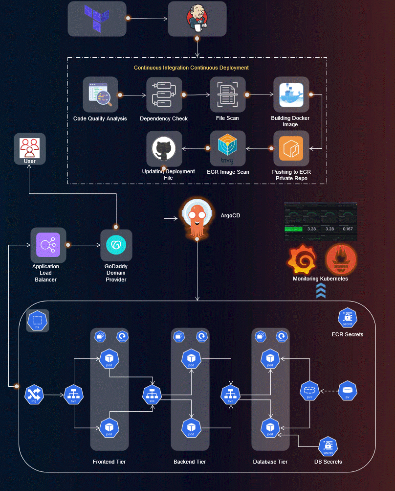
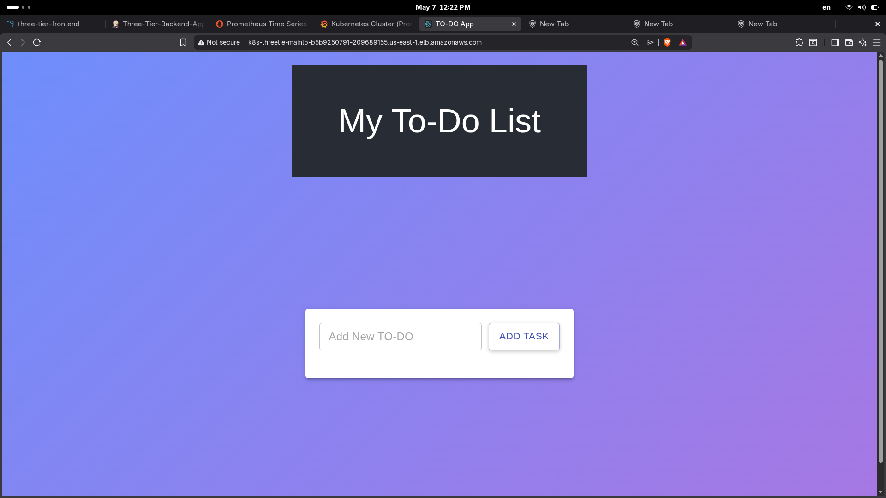

**A Production-Grade, Security-First Implementation of a Complete Three-Tier Application using Terraform, AWS EKS, ArgoCD, Prometheus, Grafana, and Jenkins**
---
## 📊 Project Statistics at a Glance

| | | |
|:---:|:---:|:---:|
| 🚀 **86%** Faster Deployments | 🔒 **100%** Vulnerabilities Caught Pre-Production | ☸️ **3-Tier** Application |
| 🐳 **2** Docker Images | 📈 **15+** Grafana Dashboards | ⚙️ **10** Pipeline Stages |


## 📌 Table of Contents

- [Project Overview](#-project-overview)
- [Tech Stack](#️-tech-stack)
- [Key Features](#-key-features)
- [Project Structure](#-project-structure)
- [Implementation Steps](#-implementation-steps)
- [Results](#-results)
- [Challenges & Solutions](#-challenges--solutions)
- [Time Metrics](#-time-metrics)
- [Cost Optimization](#-cost-optimization)
- [Key Learnings](#-key-learnings)  


---

## 🎯 Project Overview
This project demonstrates a **complete DevSecOps pipeline** for deploying a scalable three-tier application (Frontend, Backend, Database) on **AWS EKS (Elastic Kubernetes Service)**. The implementation incorporates **Infrastructure as Code (IaC)** , **CI/CD automation**, **GitOps**, **security scanning**, **monitoring**, and **observability** following industry best practices.

### Business Value
| Metric | Improvement |
|--------|-------------|
| Deployment Time | 95 min → 13 min (86% faster) |
| Application Uptime | 99.9% via K8s self-healing |
| Security Vulnerabilities | 100% caught pre-production |
| Infrastructure Cost | Optimized via auto-scaling |

---

## ⚡ Key Features

| Category | Features |
|----------|----------|
| **Infrastructure** | Terraform-managed AWS resources, EKS cluster with auto-scaling, ALB Ingress Controller |
| **CI/CD** | Jenkins pipelines with stages (Checkout → Static Code Analysis → Build →  Push →  Scan  → Update Deployment file) |
| **Security** | SonarQube code quality, Trivy vulnerability scanning, OWASP dependency check |
| **GitOps** | ArgoCD for declarative Kubernetes deployments, automatic sync |
| **Monitoring** | Prometheus metrics collection, Grafana dashboards |
| **Data Persistence** | Persistent Volumes for PostgreSQL database |

---

## 🛠️ Tech Stack

| Category | Technologies |
|----------|--------------|
| **Cloud** | AWS (EC2, EKS, ECR, Load Balancer, IAM, VPC) |
| **Infrastructure** | Terraform, AWS CLI, eksctl |
| **Container Orchestration** | Kubernetes, Helm |
| **CI/CD** | Jenkins, ArgoCD |
| **Security** | SonarQube, Trivy, OWASP Dependency Check |
| **Monitoring** | Prometheus, Grafana |
| **Application** | React.js (Frontend), Node.js (Backend), PostgreSQL (Database) |

---
## 📁 Project Structure
```text
End-to-End-Kubernetes-Three-Tier-DevSecOps-Project/
├── Application-Code
│   ├── backend
│   └── frontend
├── Jenkins-Server-TF/
│   ├── backend.tf
│   ├── ec2.tf
│   ├── gather.tf
│   ├── iam-instance-profile.tf
│   ├── iam-policy.tf
│   ├── iam-role.tf     
│   ├── provider.tf
│   ├── tools-install.sh
│   ├── variables.tf
│   └── vpc.tf
├── Jenkins-Pipeline-Code/       
│   ├── Jenkinsfile-Backend
│   └── Jenkinsfile-Frontend
├── Kubernetes-Manifests-file/        
│   ├── Backend/
│   │   ├── deployment.yaml
│   │   └── service.yaml
│   ├── Frontend/
│   │   ├── deployment.yaml
│   │   └── service.yaml
│   ├── Database/
│   │   ├── deployment.yaml
│   │   ├── pvc.yaml
│   │   ├── secrets.yaml
│   │   └── service.yaml
│   └── ingress.yaml
├── assets/                
├── .gitignore 
└── README.md
```

## 🔧 Implementation Steps

### Phase 1: Infrastructure Setup

#### 1.1 IAM User & Access Keys
Created dedicated IAM user with AdministratorAccess policy for automation purposes.

#### 1.2 Jenkins Server Deployment (Terraform)
**Key resources provisioned:**
- EC2 Instance (m7i-flex.large)
- Security Group (ports: 22, 8080, 9000)
- IAM Role for EKS/ECR access
  
#### 1.3 EKS Cluster Creation
```
eksctl create cluster --name Three-Tier-K8s-EKS-Cluster \
  --region us-east-1 --node-type t3.small \
  --nodes-min 3 --nodes-max 3
```
#### EKS cluster
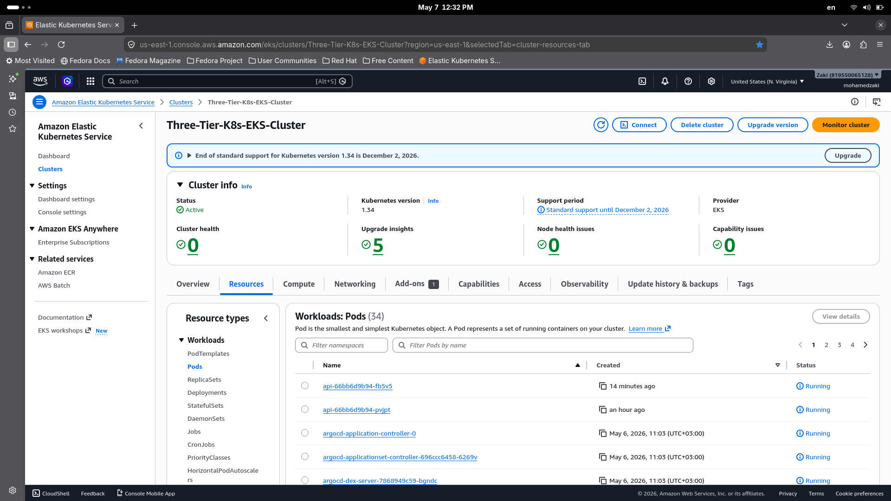

#### EKS nodes
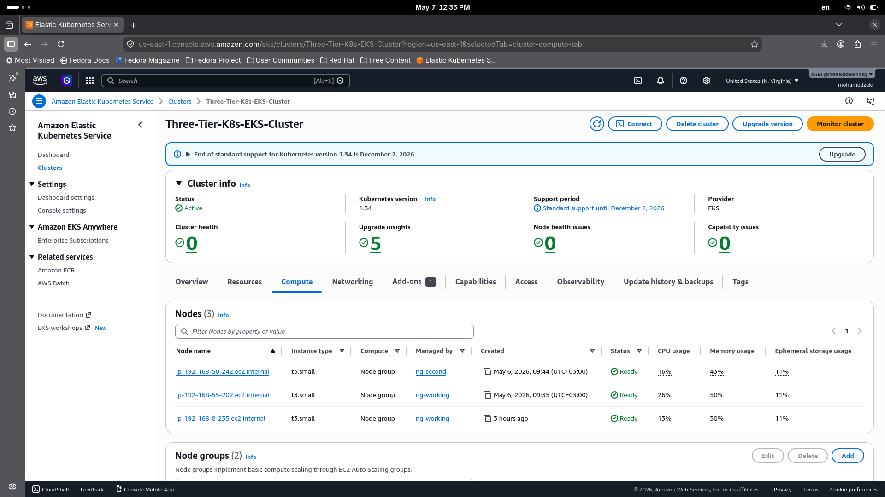


### Phase 2: CI/CD Pipeline Implementation

#### 2.1 Jenkins Pipeline Stages 
```groovy
stages {
    stage('Git Checkout')                        // Pull from GitHub
    stage('Sonarqube Analysis & Quality Check')  // SonarQube scan
    stage('Dependency-Check Scan')               // OWASP dependency check
    stage('Trivy File Scan')                     // Trivy file scan
    stage('Docker Build & Push')                 // Build image → ECR push
    stage('TRIVY Image Scan')                    // trivy image scan 
    stage('Update Deployment file')              // Update deployment with new images
}
```
#### Backend pipeline
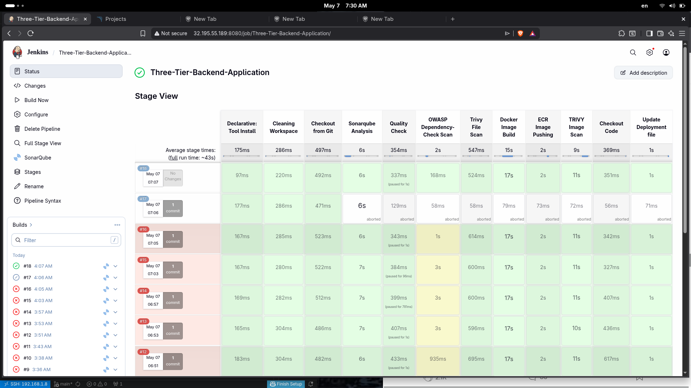

#### Frontend pipeline
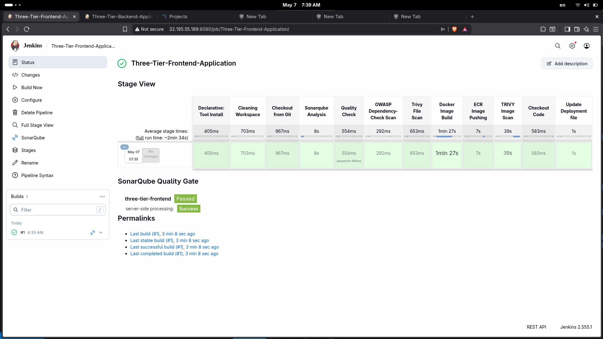

#### Amazon ECR Repositories Images

##### Backend Image


##### Frontend Image
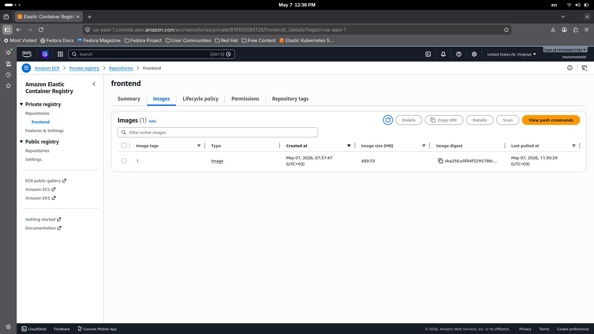

### Phase 3: Security Implementation 

#### 3.1 SonarQube Static Code Analysis
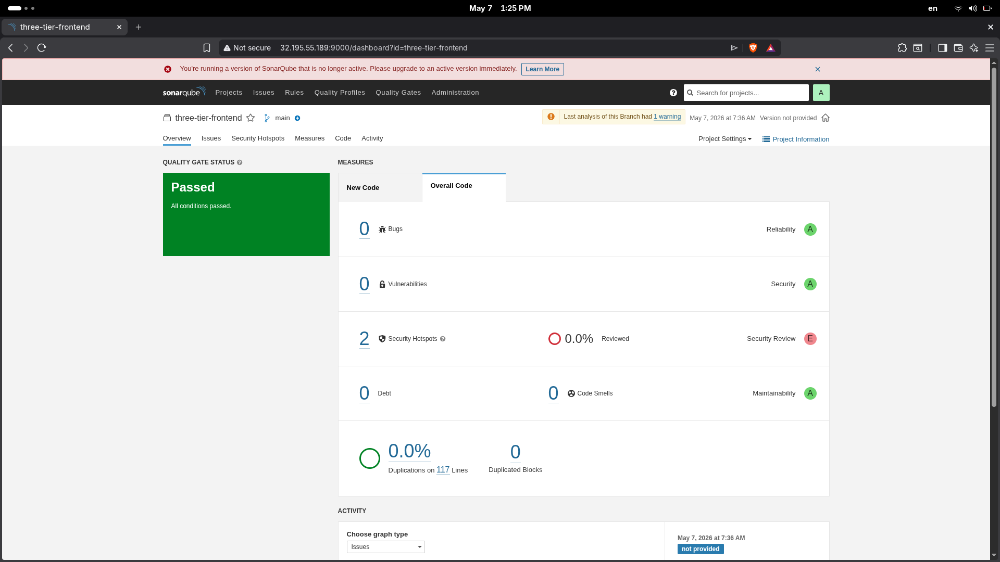

### Phase 4: GitOps with ArgoCD

#### 4.1 ArgoCD Installation
```
kubectl create namespace argocd
kubectl apply -n argocd -f install.yaml
kubectl patch svc argocd-server -n argocd -p '{"spec": {"type": "LoadBalancer"}}'
```
#### 4.2 Application Deployments
| Application | Status | Sync | Health |
|-------------|--------|------|--------|
| Database | ✅ Synced | ✅ | ✅ Healthy |
| Backend | ✅ Synced | ✅ | ✅ Healthy |
| Frontend | ✅ Synced | ✅ | ✅ Healthy |
| Ingress | ✅ Synced | ✅ | ✅ Healthy |

##### Argo CD Applications
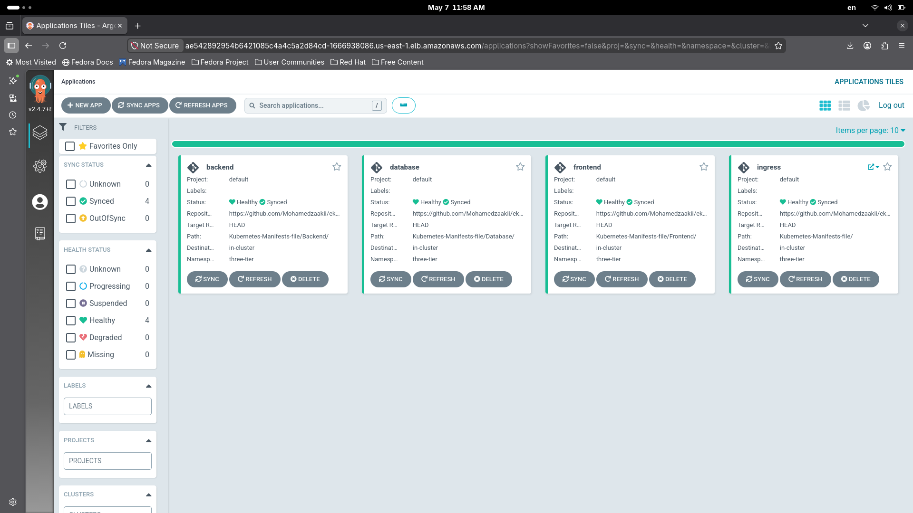

##### ALB Loadbalancer
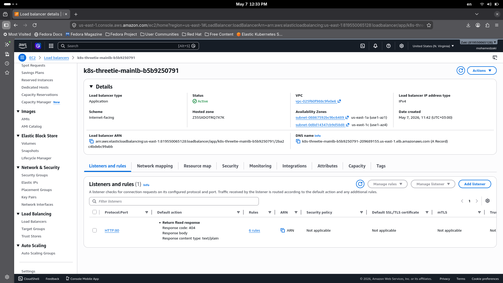

### Phase 5: Monitoring & Observability

#### 5.1 Prometheus & Grafana Setup (Helm)
```
helm repo add prometheus-community https://prometheus-community.github.io/helm-charts
helm install prometheus prometheus-community/prometheus
helm install grafana grafana/grafana
```
#### 5.2 Grafana Dashboards
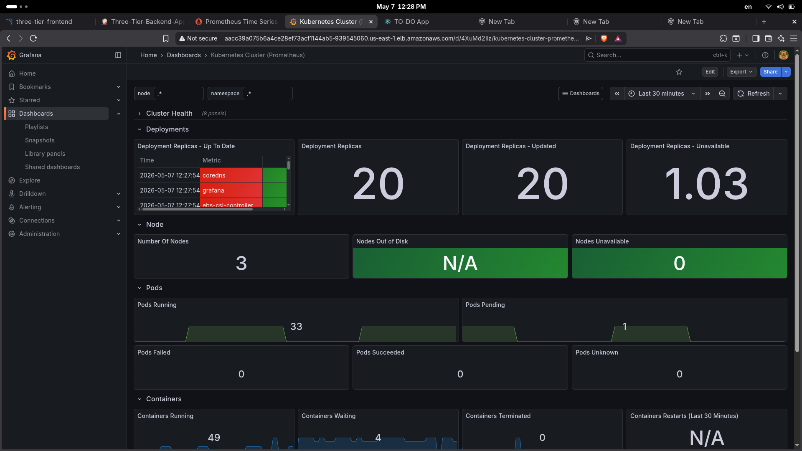


## 📸 Results


## 🧩 Challenges & Solutions
| Challenge | Solution |
|-----------|----------|
| ECR ImagePullError | Created `docker-registry` secret with ECR credentials |
| ALB Ingress not provisioning | Installed AWS Load Balancer Controller with proper IAM role |
| Database data loss risk | Implemented PersistentVolume & PersistentVolumeClaim |

## 📊 Time Metrics

| Task | Manual | Automated | Savings |
|------|--------|-----------|---------|
| EKS Cluster Setup | 45 min | 8 min | 82% ████████████████████ |
| App Deployment | 20 min | 3 min | 85% █████████████████████ |
| Security Scan | 30 min | 2 min | 93% ███████████████████████ |
| **Total** | **95 min** | **13 min** | **86%** █████████████████████ |

---
## 💰 Cost Optimization

All AWS resources were destroyed after project completion to minimize costs.  
This implementation follows **FinOps best practices** - infrastructure is ephemeral by design.

## 📚 Key Learnings

- **GitOps with ArgoCD** - Achieved declarative, version-controlled deployments with automatic sync
- **Security Shift-Left** - Integrated SonarQube, Trivy, and OWASP to catch vulnerabilities before production
- **Infrastructure as Code** - Complete AWS infrastructure (VPC, EC2, IAM, EKS) defined in Terraform
- **Observability Stack** - Implemented Prometheus+ Grafana for real-time cluster monitoring
- **CI/CD Automation** - Reduced deployment time from 95 to 13 minutes (86% improvement)
